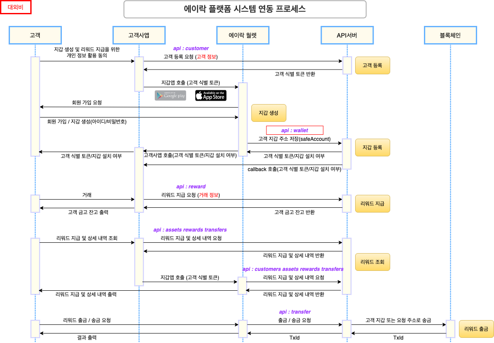

<style>
    h1 { display: none }
    h2 { font-size: 2em !important }
</style>

<h2 id="-에이락-리워드-플랫폼-api">🚀 에이락 리워드 플랫폼 API</h2>

에이락 리워드 플랫폼은 고객사의 고객에게 암호화폐 리워드를 제공하기 위하여 구축된 서비스 플랫폼입니다. 이 문서에서는 고객사와 에이락 월렛이 각각 에이락 리워드 플랫폼 API 서버와 연동하기 위하여 필요한 정보를 제공합니다.

<br/>

📡 시스템 연동 프로세스



<br/>

👩‍💻 연동 절차를 요약하면 아래와 같습니다.

1. 고객사 등록 - 고객사 정보와 계약 내용 등과 통신에 필요한 정보를 사전에 등록
2. 고객 등록 - 고객사의 고객을 에이락 리워드 플랫폼에 등록
3. 에이락 월렛 설치 - 고객이 자신의 스마트폰에 에이락 월렛을 설치하고 본인 인증/ 회원 가입
4. 고객사에서 고객에게 리워드 지급 요청
5. 고객사에서 고객에게 지급된 리워드 조회
6. 에이락 월렛에서 고객에게 지급된 리워드 조회

<br/>

✅  에이락 리워드 플랫폼과 연동하기 위하여 사전에 준비하여야 하는 사항은 아래와 같습니다.

1. 고객사 accessToken - 에이락에서 고객사에 전달
2. 고객 등록 여부를 고객사에 전달한 callback URL
3. 고객사 앱의 custom URL scheme 또는 deep link 등(선택 사항)

<br/>

🔗 에이락 리워드 플랫폼의 API 서버의 URL은 다음과 같습니다.

```jsx
https://api.alock.io/v1/{api-url}
```

- 고객 등록/리워드 지급 요청 API는 POST 방식만을 사용합니다.
- 항상 요청 프로토콜의 header에 Authorization 항목에 고객사의 토큰이 들어있어야 합니다.
- 요청에 필요한 parameter는 json 방식을 사용합니다.

<br/>

<h2 id="api-개요">API 개요</h2>

📌 API 목록 및 개략적인 내용은 다음과 같습니다.

<br/>

1. **고객 정보 등록**

    ```
    고객사 시스템에서 사용하는 고객의 고유한 아이디 값을 받아서 저장하고
    고객 식별 토큰을 생성하여 반환합니다.
    고객 식별 토큰에서는 고객사 id 값과 고객id 값이 들어 있다.
    고객사 id와 고객 id가 다르면 에이락 월렛에서 별개의 계좌가 발급되고 집계됩니다.
    ```

    - URL : /customer
    - Header
        - 고객사 API 토큰(accessToken)
    - Request
        - 고객 고유 아이디(customerUID)
    - Response
        - 고객 식별 토큰(UserToken)
        - 에이락 월렛 설치 여부(boolean)

<br/>

2. **고객 지갑 호출**

    ```
    고객사 앱에서 에이락 월렛을 호출한다.
    웹페이지를 호출합니다.
    고객 식별 토큰
    ```

    - GET:  https://afun.page.link/wallets/?userToken={UserToken}
    - Request:
        - 고객 식별 토큰(UserToken)
    - Response
        - N/A

<br/>

3. **고객 지갑 등록** - 에이락 월렛 내부에서만 사용하는 API 입니다.

    ```
    고객사 id와 고객 id로 고객 데이터를 찾고,
    고객의 지갑 주소와 공개키, deviceId, deviceType을 저장하고,
    고객 지갑이 등록되면 고객사의 callback URL로 고객 등록 여부를 보낸다.
    ```

    - URL: /wallet
    - Header
        - 지갑 API 토큰(accessToken)
    - Request
        - 고객 식별 토큰(UserToken)
        - 고객 금고 주소(safeAccount)
        - 고객 공개키 정보(publicKey)
        - 지갑 고유 번호(walletUID)
        - 지갑 고객 정보
        - deviceType
        - deviceId
    - Response
        - 고객 등록 여부

<br/>

4. **리워드 지급 요청**

    ```
    고객사 id와 고객 식별 토큰, 거래 정보를 받아서
    고객사와 계약되어 있는 내용대로 해당하는 블록체인/암호화폐/지급액을 고객에게 지급하고
    리워드 내역을 반환한다.
    ```

    - URL: /reward
    - Header
        - 고객사 API 토큰(accessToken)
    - Request
        - 고객 식별 토큰(UserToken)
        - 거래 정보 고유 아이디(requestUID)
        - 거래 일자
        - 거래 종류
        - 거래 금액
        - 거래 지역
    - Response
        - 리워드 지급 내역(rewards)

<br/>

5. **자산 내역 요청**

    ```jsx
    고객사의 고객이 리워드로 받아서 보유하고 있는 자산의 목록을 반환합니다.
    암호화폐의 네트워크/화폐종류에 따라 분류하여 각각의 잔고 목록을 반환합니다.
    ```

    - URL: /assets
    - Header
        - 고객사 API 토큰(accessToken)
    - Request
        - 고객 식별 토큰(UserToken)
    - Response
        - 토큰 잔고 내역(assets)

<br/>

6. **리워드 지급 내역 요청**

    ```jsx
    고객에게 지급된 리워드 내역 전체를 반환합니다.
    1000건 단위 페이지 또는 리워드 지급 일자, 암호화폐 종류 등에 따라 분류하여 반환하는 기능을 추후 추가할 예정입니다.
    ```

    - URL: /rewards
    - Header
        - 고객사 API 토큰(accessToken)
    - Request
        - 고객 식별 토큰(UserToken)
    - Response
        - 리워드 지급 내역(rewards)

<br/>

7. **리워드 지급 상세 내역 요청**

    ```jsx
    리워드 한 건에 대한 상세 내역을 조회하여 반환합니다.
    ```

    - URL: /rewards/{reward.id}
    - Header
        - 고객사 API 토큰(accessToken)
    - Request
        - 리워드 지급 내역 id
    - Response
        - 리워드 상세 내역(rewards)

<br/>

8. **출금 요청 - 에이락 월렛 내부에서만 사용하는 API 입니다.**

    ```jsx
    고객이 보유하고 있던 리워드를 다른 지갑으로 송금을 요청하는 api입니다.
    송금 요청은 요청 금액에 따라 승인 여부 / 요청 상태 / 처리 상태 등을
    실제 블록체인 네트워크에서 조회하여 결과를 반환합니다.
    ```

    - URL: /transfer
    - Header
        - 지갑 API 토큰(CompanyAccessToken)
    - Request
        - 고객 지갑 주소(safeAccount)
        - 암호화된 출금 요청 정보
    - Response
        - 출금 상세 내역(transfers)

<br/>

9. **출금 내역 요청**

    ```jsx
    고객이 요청한 출금 내역을 반환합니다.
    ```

    - URL: /transfers
    - Header
        - 고객사 API 토큰(accessToken)
    - Request
        - 고객 식별 토큰(accessToken)
    - Response
        - 출금 상세 내역(transfers)

<br/>

10. **출금 상세 내역 요청**

    ```jsx
    고객이 요청한 출금 내역 한건에 대하여 상세 내역을 반환합니다.
    ```

    - URL: /transfers/{transfer.id}
    - Header
        - 지갑 API 토큰(CompanyAccessToken)
    - Request
        - 고객 식별 토큰(UserToken)
        - 출금 상세 내역 id
    - Response
        - 출금 상세 내역(transfers)

<br/>

<h2 id="api-상세-내역">API 상세 내역</h2>

[https://docs.alock.io/api-spec](api-spec.md)
