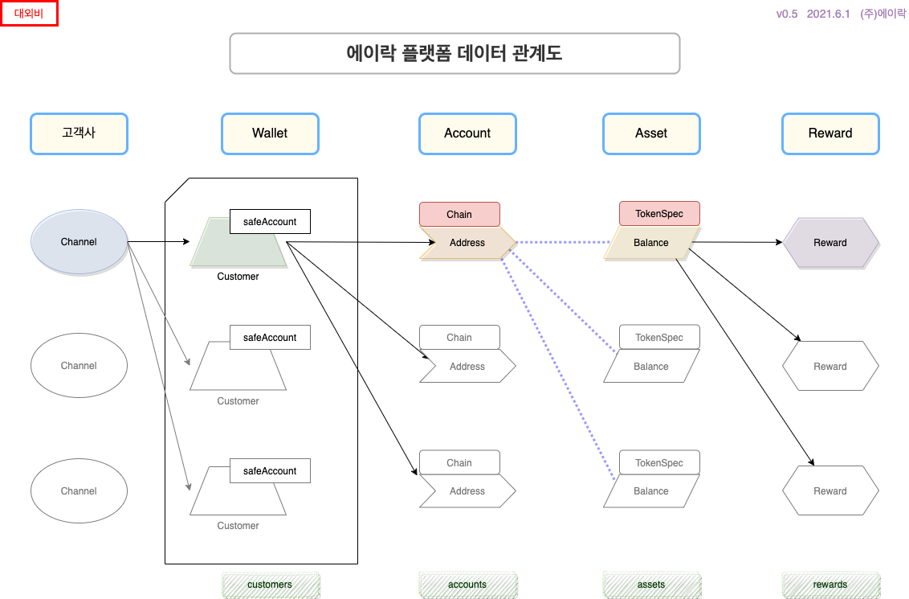

## ALock Blockchain Reward Platform REST API

- [ALock Reward Platform API Documents](api-doc.md)

- [API Specifications](api-spec.md)

<!-- Channel Plugin Scripts -->

<!-- End Channel Plugin -->

**(c) 2021, Always Fun Co., Ltd. All rights reserved**

